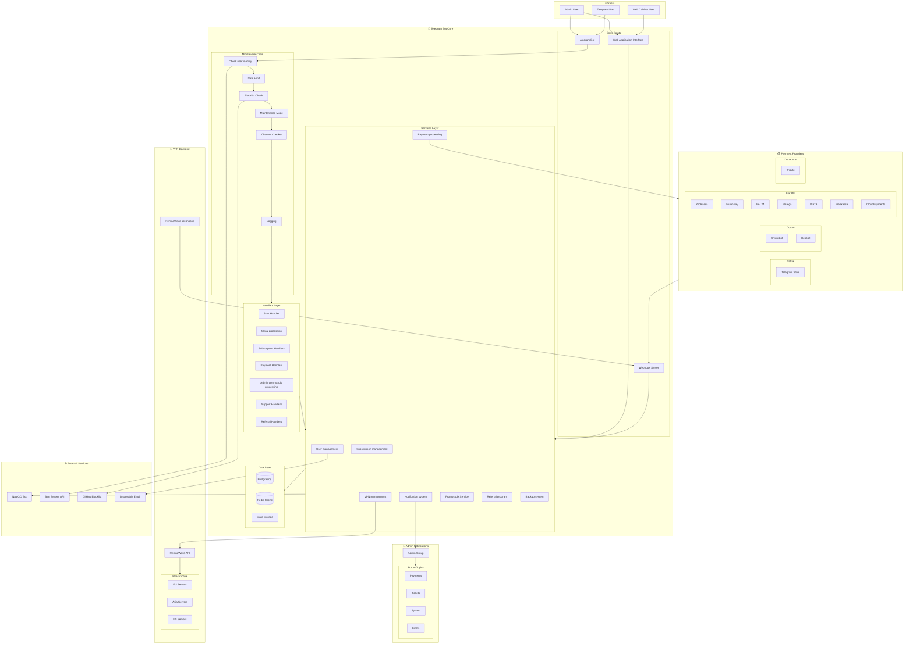
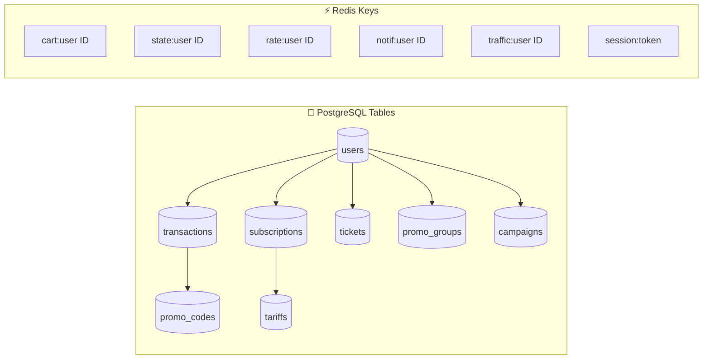

# 🏗️ System Architecture Overview

> High-level view of all system components, their relationships, and data flow between layers.

## Overview

The Remnawave Bedolaga Bot is a comprehensive Telegram-based VPN subscription management system. It integrates with multiple external services for payments, VPN backend management, tax compliance, and security.

## Architecture Diagram

## Detailed Component Diagram

## Component Description

### 👥 Users Layer

| Component | Description |
|-----------|-------------|
| **Telegram User** | End users interacting via Telegram bot interface |
| **Web Cabinet User** | Users accessing the web-based cabinet (MiniApp) |

### 🤖 Telegram Bot Layer

| Component | Technology | Purpose |
|-----------|------------|---------|
| **Aiogram Bot** | Aiogram 3.x | Async Telegram bot framework handling all user interactions |
| **Handlers Layer** | Python modules | Route messages/callbacks to appropriate business logic |
| **Services Layer** | Python services | Core business logic, orchestration, and external API calls |
| **PostgreSQL** | PostgreSQL 15+ | Primary data storage for users, subscriptions, transactions |
| **Redis Cache** | Redis 7+ | Session storage, rate limiting, caching, cart persistence |

### 💳 Payment Integrations

| Provider | Type | Primary Use Case |
|----------|------|------------------|
| **Telegram Stars** | Native | In-app purchases via Telegram's native payment system |
| **Tribute** | Donation | Telegram-native donation/tip system |
| **CryptoBot** | Crypto | Cryptocurrency payments (USDT, TON, BTC, ETH) |
| **Heleket** | Crypto | Alternative crypto payment gateway |
| **YooKassa** | Fiat | Russian bank cards and SBP (fast payments) |
| **MulenPay** | Fiat | Alternative fiat payment processing |
| **PAL24** | Fiat | SBP and card payments |
| **Platega** | Fiat | Multi-method payment gateway |
| **WATA** | Fiat | Payment processing service |
| **Freekassa** | Fiat | NSPK SBP and card payments |
| **CloudPayments** | Fiat | Cards and SBP integration |

### 🔐 VPN Backend

| Component | Purpose |
|-----------|---------|
| **RemnaWave API** | Central VPN management - user provisioning, subscription control, traffic monitoring |
| **VPN Servers/Squads** | Actual VPN server infrastructure organized in "squads" (server groups) |

### 🌐 External Services

| Service | Purpose |
|---------|---------|
| **NaloGO Tax Service** | Russian 54-FZ tax receipt generation and submission |
| **Ban System API** | Centralized ban management across multiple bots/services |
| **Blacklist Service** | GitHub-hosted blacklist for fraud prevention |

### 📢 Notifications

| Component | Purpose |
|-----------|---------|
| **Admin Telegram Group** | Central notification hub for administrators |
| **Forum Topics** | Organized notification channels (payments, support, system alerts) |

## Data Flow Summary

1. **User Input** → Bot receives messages/callbacks from Telegram
2. **Handler Processing** → Appropriate handler routes the request
3. **Service Logic** → Business services process the request
4. **Data Persistence** → PostgreSQL stores persistent data, Redis handles sessions
5. **External Calls** → Services communicate with RemnaWave, payment providers, etc.
6. **Response** → Bot sends response back to user
7. **Notifications** → Admin group receives relevant notifications

## Key Design Principles

- **Async-First**: All I/O operations are asynchronous for maximum throughput
- **Modular Services**: Each service handles a specific domain (payments, subscriptions, etc.)
- **External Abstraction**: Payment providers are abstracted behind a unified interface
- **Event-Driven**: Webhooks enable real-time updates from external services
- **Caching Strategy**: Redis reduces database load and improves response times

---

**Related Diagrams:**
- [Data Flow Diagram](./12-data-flow.md)
- [External Integrations Map](./11-external-integrations.md)

