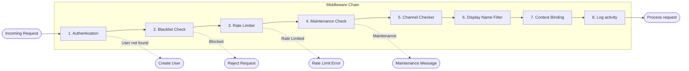
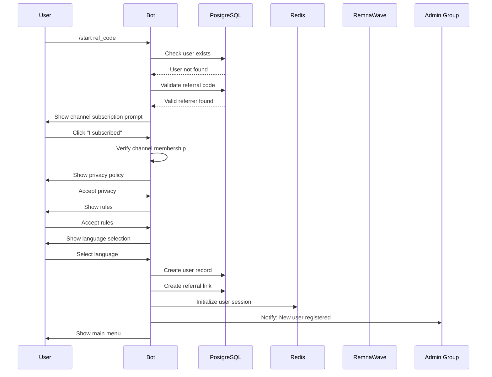
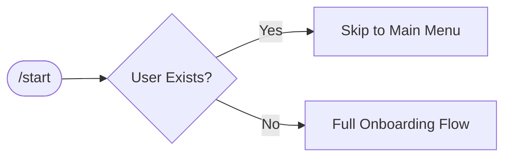
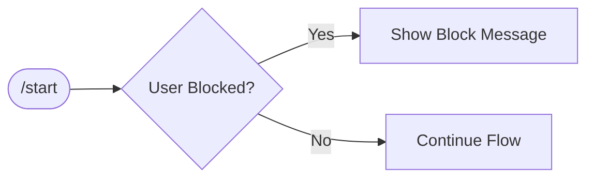

# 👤 User Registration & Onboarding Flow

> Complete user journey from the first `/start` command to reaching the main menu.

## Overview

The onboarding process ensures users accept necessary agreements, optionally join required channels, and get properly registered in the system. The flow handles referral tracking, privacy policy acceptance, and language selection.

## Flow Diagram

```mermaid
flowchart TD
    Start([User sends /start]) --> ExtractParams[Extract Deep Link Params]
    ExtractParams --> ParseParams{Parse Parameters}
    
    ParseParams -->|referral_code| ProcessReferral[Process Referral]
    ParseParams -->|campaign_id| ProcessCampaign[Process Campaign]
    ParseParams -->|empty| CheckExisting
    
    ProcessReferral --> ValidateRef{Valid Referrer?}
    ValidateRef -->|Yes| LinkReferral[Link Referral Relationship]
    ValidateRef -->|No| CheckExisting
    LinkReferral --> CheckExisting
    
    ProcessCampaign --> ValidateCamp{Campaign Active?}
    ValidateCamp -->|Yes| TagCampaign[Tag User with Campaign]
    ValidateCamp -->|No| CheckExisting
    TagCampaign --> CheckExisting
    
    CheckExisting{User Exists in DB?}
    CheckExisting -->|Yes| CheckBlocked{User Blocked?}
    CheckExisting -->|No| NewUserProcess
    
    CheckBlocked -->|Yes| ShowBlockMsg[Show Block Message]
    ShowBlockMsg --> End([End])
    CheckBlocked -->|No| CheckMaintenanceModeenance{Maintenance Mode?}
    
    CheckMaintenanceModeenance -->|Yes| ShowMaintenanceenance[Show Maintenance Message]
    CheckMaintenanceModeenance -->|No| ReturningUser[Returning User Flow]
    
    ReturningUser --> UpdateUserData[Update User Metadata]
    UpdateUserData --> CheckPinnedMsg{Pinned Message?}
    CheckPinnedMsg -->|Yes| ShowPinned[Show Pinned Message]
    CheckPinnedMsg -->|No| ShowMainMenu
    ShowPinned --> ShowMainMenu
    
    NewUserProcess[New User Flow] --> CheckChannel{Channel Sub Required?}
    
    CheckChannel -->|Yes| VerifyChannel{Verify Subscription}
    CheckChannel -->|No| CheckPrivacy
    
    VerifyChannel -->|Not Subscribed| ShowSubPrompt[Show Subscribe Prompt]
    ShowSubPrompt --> ProvideLink[Provide Channel Link]
    ProvideLink --> WaitButton[Wait for 'I Subscribed' Button]
    WaitButton --> VerifyChannel
    VerifyChannel -->|Subscribed| CheckPrivacy
    
    CheckPrivacy{Privacy Policy Accepted?}
    CheckPrivacy -->|No| ShowPrivacy[Show Privacy Policy]
    ShowPrivacy --> WaitAcceptPrivacy[Wait for Accept Button]
    WaitAcceptPrivacy --> RecordPrivacy[Record Acceptance Time]
    RecordPrivacy --> CheckRules
    CheckPrivacy -->|Yes| CheckRules
    
    CheckRules{Rules Accepted?}
    CheckRules -->|No| ShowRules[Show Service Rules]
    ShowRules --> WaitAcceptRules[Wait for Accept Button]
    WaitAcceptRules --> RecordRules[Record Acceptance Time]
    RecordRules --> CreateUser
    CheckRules -->|Yes| CreateUser
    
    CreateUser[Create User Record] --> GenerateReferralCode[Generate Referral Code]
    GenerateReferralCode --> SetDefaults[Set Default Values]
    SetDefaults --> SelectLang{Language Selection}
    
    SelectLang --> ShowLangButtons[Show Language Buttons]
    ShowLangButtons --> UserSelectsLang[User Selects Language]
    UserSelectsLang --> SaveLang[Save Language Preference]
    SaveLang --> ApplyLocale[Apply Localization]
    
    ApplyLocale --> CheckPromoOffer{Auto Promo Offer?}
    CheckPromoOffer -->|Yes| ShowPromotionOffer[Show Welcome Promo]
    CheckPromoOffer -->|No| ShowMainMenu
    ShowPromotionOffer --> ShowMainMenu[Show Main Menu]
    
    ShowMainMenu --> NotifyAdministrators[Notify Admins: New User]
    NotifyAdministrators --> UserReady([User Ready])

    style Start fill:#4CAF50
    style UserReady fill:#2196F3
    style ShowBlockMsg fill:#f44336
    style End fill:#f44336
```



## Middleware Processing Detail



## User Data Flow



## Step-by-Step Description

### 1. Start Command Received
- User sends `/start` command to the bot
- Bot extracts any deep link parameters (referral code, campaign ID)
- System checks if user already exists in database

### 2. Referral Processing
**Condition:** Start parameter contains referral code

| Action | Description |
|--------|-------------|
| Validate Code | Check if referral code exists and belongs to active user |
| Link Accounts | Create referral relationship between inviter and new user |
| Track Source | Record referral source for analytics |

**Configuration:**
```
REFERRAL_PROGRAM_ENABLED=true
REFERRAL_MINIMUM_TOPUP_KOPEKS=10000
```

### 3. Channel Subscription Check
**Condition:** `CHANNEL_IS_REQUIRED_SUB=true`

| Action | Description |
|--------|-------------|
| Check Membership | Query Telegram API for user's channel membership status |
| Show Prompt | Display subscription requirement with channel link |
| Wait & Recheck | User clicks "I subscribed" → recheck membership |

**Configuration:**
```
CHANNEL_SUB_ID=@your_channel
CHANNEL_LINK=https://t.me/your_channel
CHANNEL_IS_REQUIRED_SUB=true
CHANNEL_REQUIRED_FOR_ALL=false  # Only for new users
```

### 4. Privacy Policy Acceptance
**Condition:** User hasn't accepted privacy policy

| Action | Description |
|--------|-------------|
| Display Policy | Show privacy policy text with accept button |
| Record Acceptance | Store acceptance timestamp in user record |

**Note:** Privacy policy text is configurable via admin panel.

### 5. Rules Acceptance
**Condition:** Rules are configured and user hasn't accepted

| Action | Description |
|--------|-------------|
| Display Rules | Show service rules/terms of use |
| Record Acceptance | Store acceptance timestamp |

### 6. User Creation/Update
| Action | Description |
|--------|-------------|
| Generate Referral Code | Create unique referral code for new user |
| Set Default Language | Assign default language (can be changed) |
| Initialize Balance | Set balance to 0 |
| Record Metadata | Store Telegram ID, username, full name |

### 7. Language Selection
| Action | Description |
|--------|-------------|
| Show Languages | Display available language options |
| Save Selection | Update user's preferred language |
| Apply Localization | All subsequent messages use selected language |

**Configuration:**
```
LANGUAGES=ru,en,uk
DEFAULT_LANGUAGE=ru
```

### 8. Main Menu Display
User sees the main menu with available options:
- 🔐 My Subscription
- 💰 Top-up Balance
- 👥 Referral Program
- ❓ Support
- ⚙️ Settings

## Edge Cases

### Existing User Returns


### Blocked User


### Campaign Tracking
If user arrives via advertising campaign link:
- Campaign ID is extracted from deep link
- User is tagged with campaign for attribution
- Campaign bonuses may be applied after registration

## Database Changes

| Table | Action | Fields |
|-------|--------|--------|
| `users` | INSERT/UPDATE | Telegram ID, username, full_name, language, referral_code |
| `users` | UPDATE | referrer ID (if referral) |
| `users` | UPDATE | privacy_policy_accepted_at, rules_accepted_at |

## Related Configuration

```env
# Channel Requirements
CHANNEL_SUB_ID=@your_channel
CHANNEL_LINK=https://t.me/your_channel
CHANNEL_IS_REQUIRED_SUB=true
CHANNEL_DISABLE_TRIAL_ON_UNSUBSCRIBE=true

# Localization
LANGUAGES=ru,en
DEFAULT_LANGUAGE=ru

# Referral
REFERRAL_PROGRAM_ENABLED=true
```

---

**Related Diagrams:**
- [Trial Activation](./05-trial-activation.md)
- [Referral System](./08-referral-system.md)
- [Complete User Journey](./13-user-journey.md)

