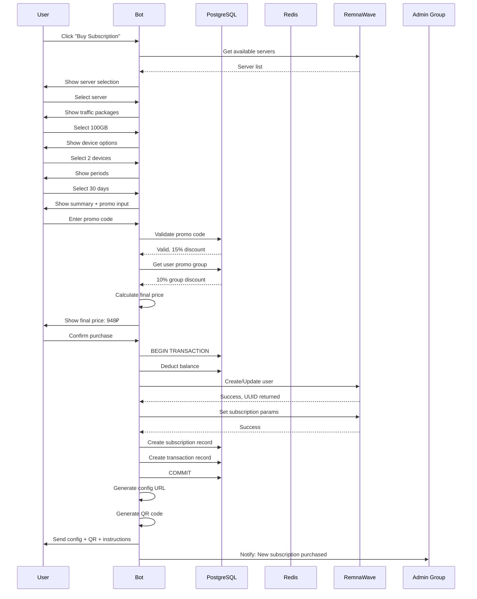
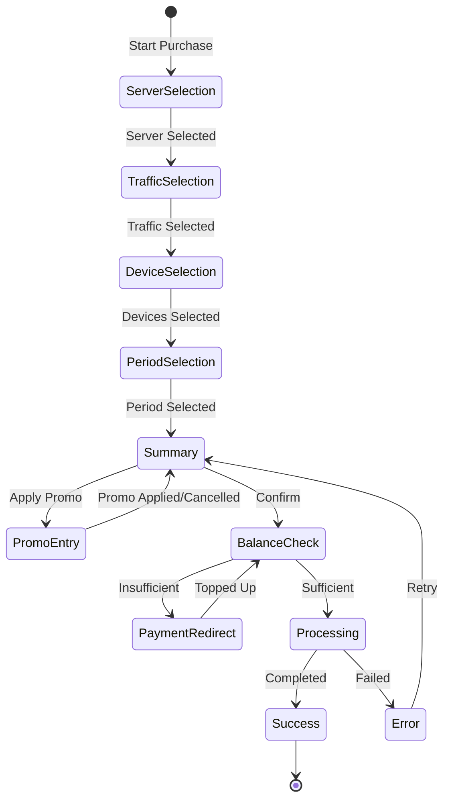
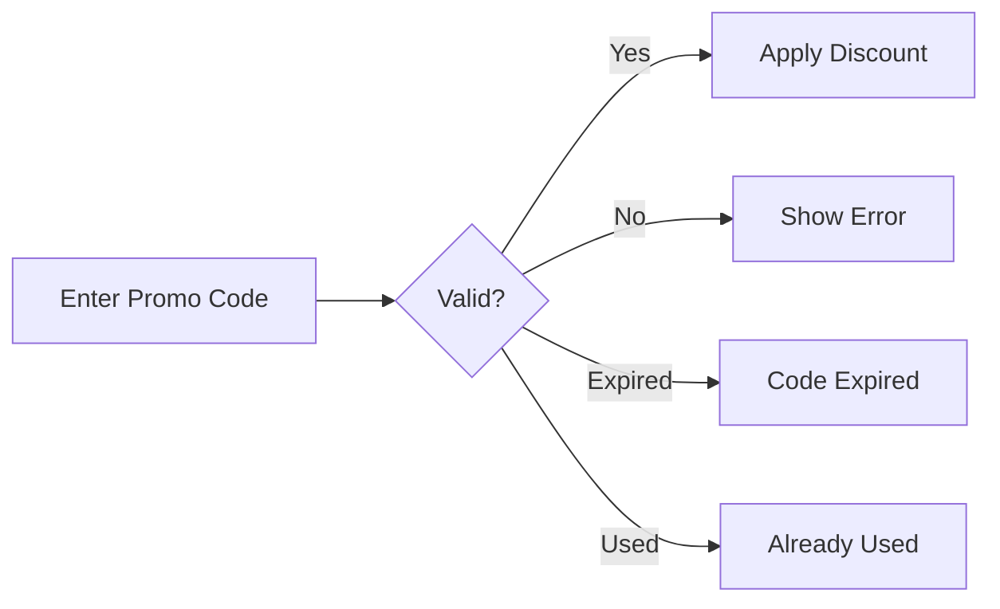
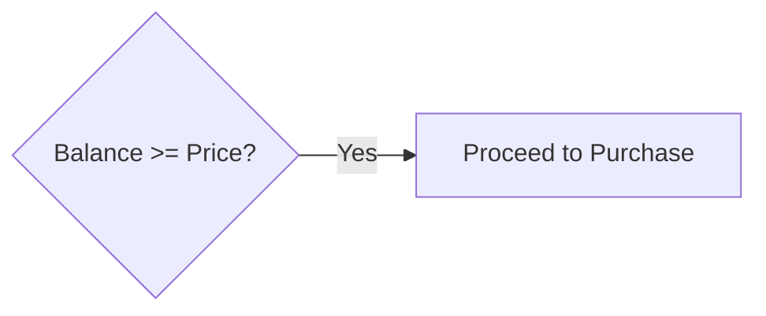
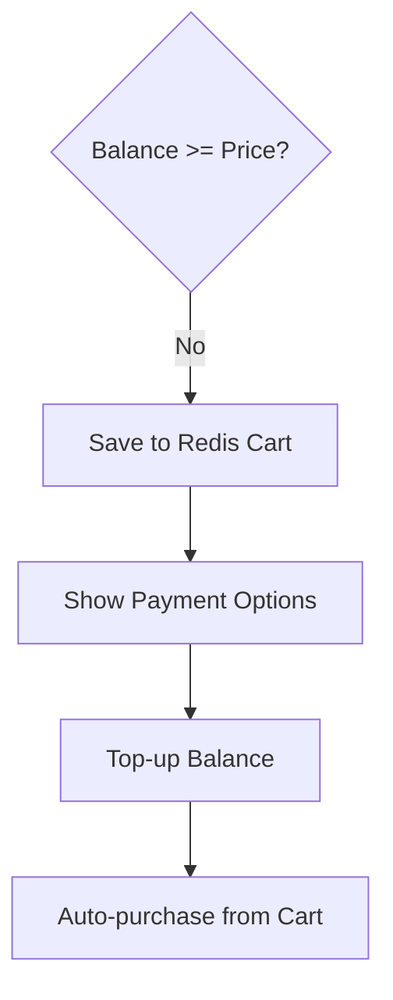

# 🛒 Subscription Purchase Flow (Classic Mode)

> Traditional subscription purchase with full customization: server selection, traffic packages, device limits, and period selection.

## Overview

Classic mode gives users maximum flexibility in configuring their VPN subscription. Users can choose specific servers, traffic amounts, number of devices, and subscription duration. This mode is ideal for advanced users who want granular control.

## Flow Diagram

```mermaid
flowchart TD
    MainMenu([Main Menu]) --> CheckExisting{Has Active Subscription?}
    
    CheckExisting -->|Yes| ShowExtendOptions[Show Extend/Modify Options]
    CheckExisting -->|No| BuySub[Click Buy Subscription]
    
    ShowExtendOptions --> ExtendChoice{User Choice}
    ExtendChoice -->|Extend| ExtendFlow[Extend Subscription Flow]
    ExtendChoice -->|New| BuySub
    
    BuySub --> LoadServers[Load Available Servers]
    LoadServers --> CheckServerCount{Server Count}
    
    CheckServerCount -->|1 Server| AutoSelectServer[Auto-select Single Server]
    CheckServerCount -->|Multiple| ShowServerList[Show Server Selection]
    
    ShowServerList --> UserSelectServer[User Selects Server]
    UserSelectServer --> CheckMultiSelect{Multi-select Enabled?}
    CheckMultiSelect -->|Yes| AllowMultiple[Allow Multiple Selection]
    CheckMultiSelect -->|No| SingleServer[Single Server Only]
    AllowMultiple --> SelectTraffic
    SingleServer --> SelectTraffic
    AutoSelectServer --> SelectTraffic
    
    SelectTraffic{Traffic Selection Mode}
    SelectTraffic -->|selectable| ShowTrafficPackages[Show Traffic Packages]
    SelectTraffic -->|fixed| UseFixedTraffic[Use Fixed Traffic Limit]
    
    ShowTrafficPackages --> UserSelectTraffic[User Selects Package]
    UserSelectTraffic --> CheckDevicesEnabled{Devices Selection?}
    UseFixedTraffic --> CheckDevicesEnabled
    
    CheckDevicesEnabled -->|Enabled| ShowDevices[Show Device Options]
    CheckDevicesEnabled -->|Disabled| UseDefaultDevices[Use Default Devices]
    
    ShowDevices --> UserSelectDevices[User Selects Devices]
    UserSelectDevices --> SelectPeriod
    UseDefaultDevices --> SelectPeriod
    
    SelectPeriod[Show Available Periods] --> UserSelectPeriod[User Selects Period]
    UserSelectPeriod --> ShowSummary[Show Order Summary]
    
    ShowSummary --> PromotionOption{Apply Promo?}
    PromotionOption -->|Yes| EnterPromotion[Enter Promo Code]
    PromotionOption -->|No| CalculateFinalPrice
    
    EnterPromotion --> ValidatePromotion{Validate Code}
    ValidatePromotion -->|Valid| ApplyDiscount[Apply Discount]
    ValidatePromotion -->|Invalid| ShowPromotionError[Show Error]
    ValidatePromotion -->|Expired| ShowExpired[Code Expired]
    ValidatePromotion -->|Used| ShowUsedError[Already Used]
    ShowPromotionError --> PromotionOption
    ShowExpired --> PromotionOption
    ShowUsedError --> PromotionOption
    ApplyDiscount --> CalculateFinalPrice
    
    CalculateFinalPrice[Calculate Final Price] --> ApplyPromotionGroup[Apply Promo Group Discounts]
    ApplyPromotionGroup --> ApplyPeriodDiscount[Apply Period Discounts]
    ApplyPeriodDiscount --> ShowFinalPrice[Display Final Price]
    
    ShowFinalPrice --> CheckBalanceance{Balance >= Price?}
    CheckBalanceance -->|Yes| ShowConfirm[Show Confirmation]
    CheckBalanceance -->|No| InsufficientBalance[Insufficient Balance]
    
    InsufficientBalance --> SaveToCart[Save to Redis Cart]
    SaveToCart --> ShowPaymentOptions[Show Payment Methods]
    ShowPaymentOptions --> UserPays[User Tops Up]
    UserPays --> AutoPurchase{Auto-Purchase Enabled?}
    AutoPurchase -->|Yes| RestoreCart[Restore from Cart]
    AutoPurchase -->|No| ReturnToMenu[Return to Menu]
    RestoreCart --> ShowConfirm
    
    ShowConfirm --> UserConfirms[User Confirms Purchase]
    UserConfirms --> StartTransaction[Process purchase]
    
    StartTransaction --> DeductBalance[Subtract from balance]
    DeductBalance --> CheckRemnaWaveUser{VPN account exists?}
    
    CheckRemnaWaveUser -->|No| CreateRemnaWaveUser[Create VPN account]
    CheckRemnaWaveUser -->|Yes| UpdateRemnaWaveUser[Update VPN account]
    
    CreateRemnaWaveUser --> SetSubscriptionParams
    UpdateRemnaWaveUser --> SetSubscriptionParams
    
    SetSubscriptionParams[Set Subscription Parameters] --> ApplyToRemna[Apply to VPN service]
    ApplyToRemna --> RemnaSuccess{RemnaWave Success?}
    
    RemnaSuccess -->|No| RollbackBalance[Rollback Balance]
    RollbackBalance --> ShowError[Show Error Message]
    ShowError --> ReturnToMenu
    
    RemnaSuccess -->|Yes| CreateSubscriptionRecord[Create subscription record]
    CreateSubscriptionRecord --> CreateTransactionaction[Create transaction record]
    CreateTransactionaction --> CommitTransactionaction[Commit DB Transaction]
    
    CommitTransactionaction --> GenerateConfig[Create connection settings]
    GenerateConfig --> GenerateQRCode[Create QR code]
    GenerateQRCode --> SendToUser[Send connection details to user]
    SendToUser --> SendInstructions[Send Setup Instructions]
    SendInstructions --> NotifyAdministrators[Notify Admin Group]
    NotifyAdministrators --> Success([Purchase Complete])

    style MainMenu fill:#4CAF50
    style Success fill:#2196F3
    style ShowError fill:#f44336
    style RollbackBalance fill:#f44336
```



## Sequence Diagram



## State Machine



## Step-by-Step Description

### 1. Server/Squad Selection
User chooses from available VPN server locations.

| Feature | Description |
|---------|-------------|
| Auto-skip | If only one server available, step is skipped |
| Multi-select | Users can select multiple servers if enabled |
| Server Info | Shows server location, load, and status |

**Configuration:**
```env
# Servers are synced from RemnaWave API
REMNAWAVE_AUTO_SYNC_ENABLED=true
REMNAWAVE_AUTO_SYNC_TIMES=03:00
```

### 2. Traffic Package Selection
User selects desired traffic limit.

| Package | Default Price (kopeks) |
|---------|----------------------|
| 5 GB | 2,000 |
| 10 GB | 3,500 |
| 25 GB | 7,000 |
| 50 GB | 11,000 |
| 100 GB | 15,000 |
| 250 GB | 17,000 |
| 500 GB | 19,000 |
| 1000 GB | 19,500 |
| Unlimited | 20,000 |

**Configuration:**
```env
TRAFFIC_SELECTION_MODE=selectable  # selectable, fixed, fixed_with_topup
PRICE_TRAFFIC_5GB=2000
PRICE_TRAFFIC_100GB=15000
PRICE_TRAFFIC_UNLIMITED=20000
```

### 3. Device Limit Selection
User chooses how many devices can connect simultaneously.

| Option | Description |
|--------|-------------|
| 1 Device | Base price |
| 2+ Devices | +PRICE_PER_DEVICE per additional device |
| Max Limit | Configurable via MAX_DEVICES_LIMIT |

**Configuration:**
```env
DEVICES_SELECTION_ENABLED=true
PRICE_PER_DEVICE=5000
MAX_DEVICES_LIMIT=20
DEFAULT_DEVICE_LIMIT=1
```

### 4. Period Selection
User selects subscription duration.

| Period | Default Price (kopeks) |
|--------|----------------------|
| 14 days | 50,000 |
| 30 days | 99,000 |
| 60 days | 189,000 |
| 90 days | 269,000 |
| 180 days | 499,000 |
| 360 days | 899,000 |

**Configuration:**
```env
AVAILABLE_SUBSCRIPTION_PERIODS=14,30,60,90,180,360
PRICE_14_DAYS=50000
PRICE_30_DAYS=99000
PRICE_90_DAYS=269000
```

### 5. Promo Code Application (Optional)
User can enter a promotional code for discounts.



**Promo Types:**
- **Percentage Discount** - X% off total price
- **Fixed Amount** - X rubles off
- **Free Days** - Add bonus days
- **Balance Credit** - Add to user balance

### 6. Price Calculation
Final price considers:
- Base period price
- Traffic package cost
- Additional devices cost
- Promo group discounts
- Period-based discounts
- Promo code discount

```
Final Price = (Period + Traffic + Devices) × (1 - PromoGroupDiscount) × (1 - PromoCodeDiscount)
```

### 7. Balance Check & Cart

**Sufficient Balance:**


**Insufficient Balance:**


**Cart Configuration:**
```env
CART_TTL_SECONDS=3600  # Cart expires in 1 hour
AUTO_PURCHASE_AFTER_TOPUP_ENABLED=true
```

### 8. Purchase Execution

| Step | Action | System |
|------|--------|--------|
| 1 | Deduct balance | PostgreSQL |
| 2 | Create/update user | RemnaWave API |
| 3 | Apply subscription settings | RemnaWave API |
| 4 | Create subscription record | PostgreSQL |
| 5 | Generate transaction | PostgreSQL |
| 6 | Send VPN config | Telegram Bot |
| 7 | Notify admins | Telegram (Forum Topic) |

### 9. VPN Configuration Delivery
User receives:
- Subscription URL (for app import)
- QR code (for mobile apps)
- Connection instructions
- App download links (optional)

## Price Calculation Example

```
User Selection:
- Period: 30 days (99,000 kop)
- Traffic: 100 GB (15,000 kop)
- Devices: 3 (+10,000 kop for 2 extra)
- Promo Group: 10% discount
- Promo Code: 15% discount

Calculation:
Base = 99,000 + 15,000 + 10,000 = 124,000 kop
After Group Discount = 124,000 × 0.90 = 111,600 kop
After Promo Code = 111,600 × 0.85 = 94,860 kop

Final Price: 948.60 ₽
```

## Database Changes

| Table | Action | Fields |
|-------|--------|--------|
| `users` | UPDATE | balance (deduct) |
| `subscriptions` | INSERT | user ID, remnawave_uuid, period_days, traffic_gb, devices |
| `transactions` | INSERT | user ID, amount, type=SUBSCRIPTION_PURCHASE |

## Error Handling

| Error | Recovery |
|-------|----------|
| RemnaWave API failure | Rollback balance, show error |
| Insufficient balance | Save cart, redirect to top-up |
| Invalid promo code | Show validation error, continue without discount |
| Server unavailable | Remove from selection, refresh list |

---

**Related Diagrams:**
- [Subscription Purchase (Tariff Mode)](./04-subscription-purchase-tariff.md)
- [Payment Processing](./06-payment-processing.md)
- [Subscription Renewal](./07-subscription-renewal.md)

