# 📦 Subscription Purchase Flow (Tariff Mode)

> Simplified subscription purchase with pre-configured tariff packages for a streamlined user experience.

## Overview

Tariff mode offers users ready-made subscription packages with fixed parameters (traffic, devices, servers, period). This mode simplifies the purchase process and is ideal for most users who want a quick, hassle-free experience.

## Flow Diagram

```mermaid
flowchart TD
    MainMenu([Main Menu]) --> CheckExisting{Has Active Subscription?}
    
    CheckExisting -->|Yes| ShowRenewalOptions[Show Renewal/Upgrade]
    CheckExisting -->|No| LoadTariffs[Load Active Tariffs]
    
    ShowRenewalOptions --> RenewalChoice{User Choice}
    RenewalChoice -->|Renew Same| QuickRenew[Quick Renewal Flow]
    RenewalChoice -->|Change Plan| LoadTariffs
    RenewalChoice -->|Cancel| ReturnMenu[Return to Menu]
    
    LoadTariffs --> SortTariffs[Sort by Display Order]
    SortTariffs --> FilterActive[Filter Active Only]
    FilterActive --> GroupByCategory{Categorize Tariffs}
    
    GroupByCategory --> ShowTariffGrid[Display Tariff Grid]
    
    ShowTariffGrid --> UserSelectsTariff[User Selects Tariff]
    UserSelectsTariff --> LoadTariffDetails[Load Full Tariff Details]
    
    LoadTariffDetails --> ShowDetails[Show Tariff Card]
    
    subgraph TariffCard["📦 Tariff Details Card"]
        CardName[Tariff Name]
        CardDesc[Description]
        CardTraffic[Traffic: X GB]
        CardDevices[Devices: X]
        CardPeriod[Period: X days]
        CardServers[Servers: List]
        CardPrice[Price: X ₽]
    end
    
    ShowDetails --> PromotionOption{Apply Promo?}
    PromotionOption -->|Yes| EnterPromotion[Enter Promo Code]
    PromotionOption -->|No| LoadDiscounts
    
    EnterPromotion --> ValidatePromotion{Validate}
    ValidatePromotion -->|Valid| CheckTariffRestriction{Allowed for Tariff?}
    ValidatePromotion -->|Invalid| ShowPromotionError[Show Error]
    ShowPromotionError --> PromotionOption
    
    CheckTariffRestriction -->|Yes| ApplyPromotionDiscount[Apply Promo Discount]
    CheckTariffRestriction -->|No| ShowRestricted[Code Not Valid for This Tariff]
    ShowRestricted --> PromotionOption
    ApplyPromotionDiscount --> LoadDiscounts
    
    LoadDiscounts[Load User Promo Group] --> CalculateGroupDiscount[Calculate Group Discount]
    CalculateGroupDiscount --> CalculatePeriodDiscount[Calculate Period Discount]
    CalculatePeriodDiscount --> CalculateFinalPrice[Calculate Final Price]
    
    CalculateFinalPrice --> ShowPriceBreakdown[Show Price Breakdown]
    
    subgraph PriceBreakdown["💰 Price Breakdown"]
        BasePrice[Base Price: X ₽]
        GroupDisc[Group Discount: -X%]
        PromoDisc[Promo Discount: -X%]
        FinalPrice[Final Price: X ₽]
    end
    
    ShowPriceBreakdown --> CheckBalanceance{Balance >= Price?}
    
    CheckBalanceance -->|Yes| ShowConfirmation[Show Purchase Confirmation]
    CheckBalanceance -->|No| ShowInsufficientOptions
    
    ShowInsufficientOptions[Insufficient Balance] --> SaveToCart[Save Tariff to Cart]
    SaveToCart --> ShowPaymentMethods[Show Payment Methods]
    
    ShowPaymentMethods --> PaymentChoice{Select Method}
    PaymentChoice -->|Telegram Stars| StarsPayment[Stars Payment]
    PaymentChoice -->|Crypto| CryptoPayment[Crypto Payment]
    PaymentChoice -->|Bank Card| CardPayment[Card Payment]
    PaymentChoice -->|SBP| SBPPayment[SBP Payment]
    
    StarsPayment --> ProcessPayment[Process payment]
    CryptoPayment --> ProcessPayment
    CardPayment --> ProcessPayment
    SBPPayment --> ProcessPayment
    
    ProcessPayment -->|Success| BalanceUpdated[Balance Updated]
    ProcessPayment -->|Failed| ShowPaymentError[Show Error]
    ShowPaymentError --> ShowPaymentMethods
    
    BalanceUpdated --> CheckAutoProcess{Auto-Purchase?}
    CheckAutoProcess -->|Yes| RestoreFromCart[Restore Cart]
    CheckAutoProcess -->|No| ReturnMenu
    RestoreFromCart --> ShowConfirmation
    
    ShowConfirmation --> UserConfirms[User Confirms]
    UserConfirms --> BeginTransactionaction[Process purchase]
    
    BeginTransactionaction --> DeductBalance[Subtract from balance]
    DeductBalance --> CheckRemnaWaveUser{RemnaWave User?}
    
    CheckRemnaWaveUser -->|Exists| UpdateRemnaWave[Update User]
    CheckRemnaWaveUser -->|New| CreateRemnaWave[Create User]
    
    UpdateRemnaWave --> ApplyTariffSettings
    CreateRemnaWave --> ApplyTariffSettings
    
    ApplyTariffSettings[Apply Tariff Settings] --> SetTraffic[Set data allowance]
    SetTraffic --> SetDevices[Set number of devices]
    SetDevices --> SetServers[Set Allowed Servers]
    SetServers --> SetExpiry[Set when subscription ends]
    SetExpiry --> SetTag[Mark user type]
    
    SetTag --> RemnaWaveAPICall[RemnaWave API Call]
    RemnaWaveAPICall --> RemnaWaveResult{Success?}
    
    RemnaWaveResult -->|No| Rollback[Rollback Transaction]
    Rollback --> ShowError[Show Error]
    ShowError --> ReturnMenu
    
    RemnaWaveResult -->|Yes| CreateSubscriptionRecord[Create Subscription]
    CreateSubscriptionRecord --> LinkTariff[Link Tariff ID]
    LinkTariff --> CreateTransaction[Create Transaction]
    CreateTransaction --> CommitTransaction[Complete operation]
    
    CommitTransaction --> GenerateConfig[Create connection link]
    GenerateConfig --> GenerateQRCode[Create QR code]
    GenerateQRCode --> GenerateHapp{HAPP Link?}
    GenerateHapp -->|Yes| AddHappLink[Add HAPP Link]
    GenerateHapp -->|No| PrepareMessage
    AddHappLink --> PrepareMessage
    
    PrepareMessage[Prepare Message] --> SendConfig[Send to User]
    SendConfig --> SendInstructions[Send Instructions]
    SendInstructions --> NotifyAdministrator[Notify Admins]
    NotifyAdministrator --> Success([Purchase Complete ✅])
    
    QuickRenew --> CalculateRenewalPrice[Calculate Renewal Price]
    CalculateRenewalPrice --> CheckBalanceance

    style MainMenu fill:#4CAF50
    style Success fill:#2196F3
    style ShowError fill:#f44336
    style Rollback fill:#f44336
```



## Tariff Selection UI

```mermaid
flowchart LR
    subgraph TariffGrid["Tariff Selection Grid"]
        direction TB
        T1["🌟 Starter<br/>50GB • 1 device<br/>299 ₽/month"]
        T2["⭐ Basic<br/>100GB • 2 devices<br/>499 ₽/month"]
        T3["💎 Premium<br/>Unlimited • 5 devices<br/>899 ₽/month"]
        T4["👑 Annual<br/>Unlimited • 5 devices<br/>4,999 ₽/year"]
    end
    
    User([User]) --> TariffGrid
    T1 --> Selected[Show Details]
    T2 --> Selected
    T3 --> Selected
    T4 --> Selected
```



## Sequence Diagram


## Tariff Package Structure

| Field | Description |
|-------|-------------|
| `name` | Display name (e.g., "Basic", "Premium") |
| `description` | Detailed description |
| `period_days` | Subscription duration |
| `traffic_limit_gb` | Traffic allowance (0 = unlimited) |
| `device_limit` | Max simultaneous devices |
| `price_kopeks` | Base price |
| `allowed_squads` | Available servers |
| `is_active` | Visibility flag |
| `sort_order` | Display order |

## Example Tariffs

| Tariff | Period | Traffic | Devices | Price |
|--------|--------|---------|---------|-------|
| Starter | 30 days | 50 GB | 1 | 299 ₽ |
| Basic | 30 days | 100 GB | 2 | 499 ₽ |
| Premium | 30 days | Unlimited | 5 | 899 ₽ |
| Annual | 365 days | Unlimited | 5 | 4,999 ₽ |

## Configuration

```env
SALES_MODE=tariffs  # Enable tariff mode (alternative: 'classic')
TRIAL_TARIFF_ID=0   # Tariff ID for trial (0 = standard settings)
```

## Price Calculation

```
Final Price = Tariff Base Price × (1 - Promo Group Discount) × (1 - Promo Code Discount)
```

## Advantages Over Classic Mode

| Aspect | Classic Mode | Tariff Mode |
|--------|--------------|-------------|
| User Experience | Complex, many steps | Simple, 2-3 clicks |
| Decision Fatigue | High (many options) | Low (curated options) |
| Support Load | Higher (confusion) | Lower (clear packages) |
| Pricing Control | User-driven | Business-driven |
| Upselling | Manual | Built into tariff tiers |

## Purchase Execution Steps

| Step | Action | System |
|------|--------|--------|
| 1 | Validate tariff | Check tariff is active |
| 2 | Deduct balance | PostgreSQL transaction |
| 3 | Create RemnaWave user | RemnaWave API |
| 4 | Apply tariff settings | Traffic, devices, servers |
| 5 | Create subscription | PostgreSQL |
| 6 | Generate config | Subscription URL + QR |
| 7 | Send to user | Telegram message |
| 8 | Notify admins | Forum topic |

## Error Handling

| Error | User Message | Recovery |
|-------|--------------|----------|
| Tariff not found | "This plan is no longer available" | Refresh tariff list |
| Tariff inactive | "This plan is currently unavailable" | Show alternative |
| Server unavailable | "Selected server is offline" | Use fallback server |
| Payment failed | "Payment could not be processed" | Retry or different method |

---

**Related Diagrams:**
- [Subscription Purchase (Classic)](./03-subscription-purchase-classic.md)
- [Payment Processing](./06-payment-processing.md)
- [Trial Activation](./05-trial-activation.md)

