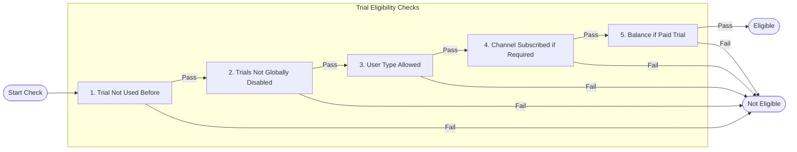
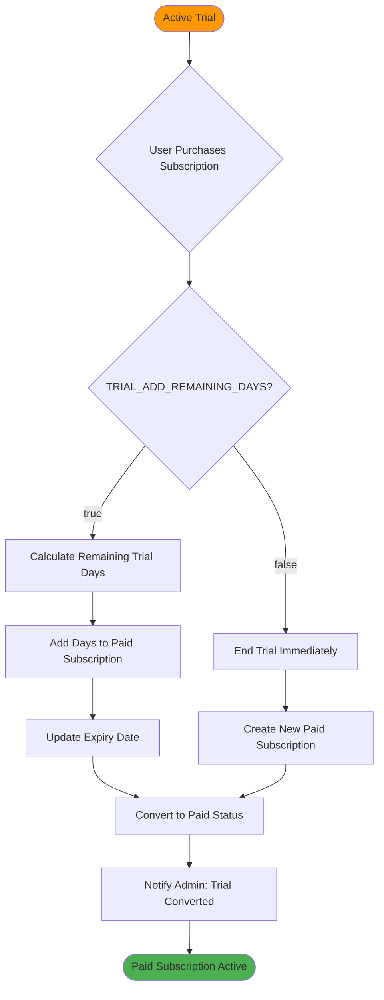
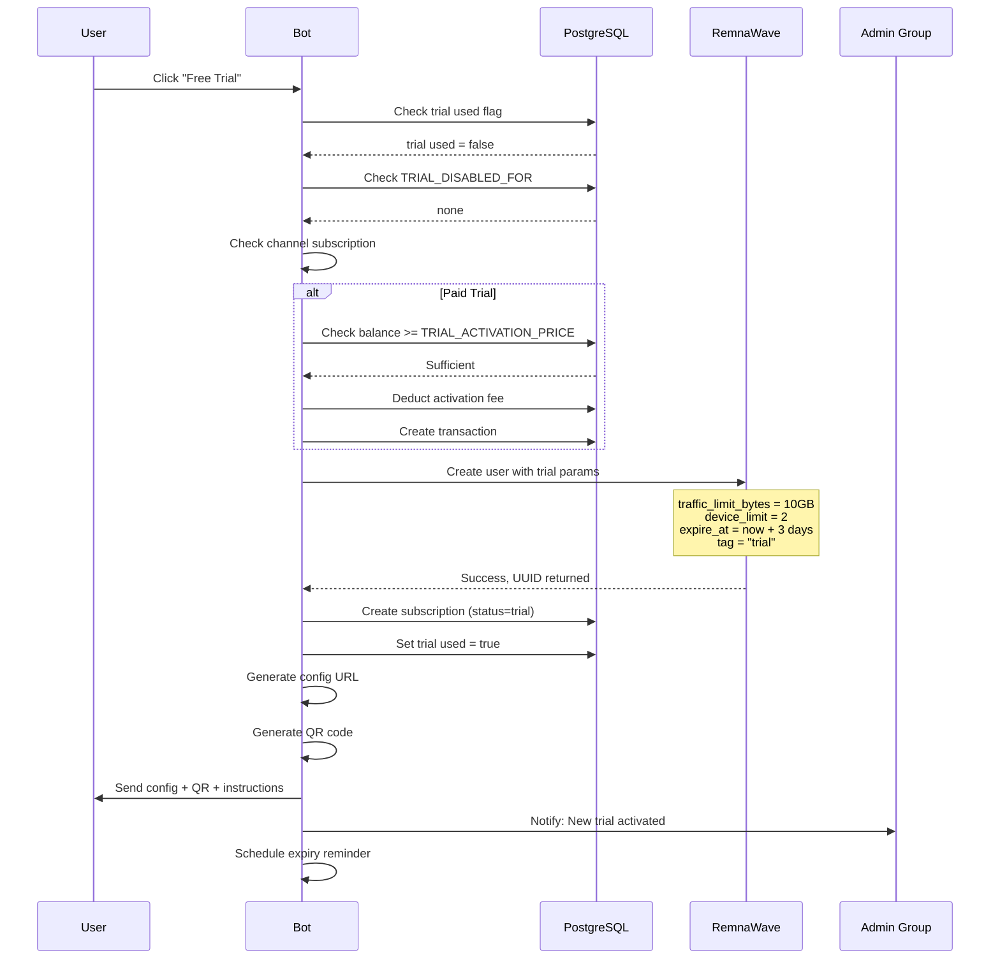

# 🎁 Trial Activation Flow

> Free trial activation process with eligibility checks and VPN configuration delivery.

## Overview

The trial system allows new users to test the VPN service before committing to a paid subscription. Trials can be free or require a small activation fee.

## Flow Diagram

```mermaid
flowchart TD
    MainMenu([Main Menu]) --> ClickTrial[Click Free Trial]
    ClickTrial --> LoadUserData[Get user information]
    
    LoadUserData --> CheckTrialUsed{Trial Already Used?}
    CheckTrialUsed -->|Yes| ShowAlreadyUsed[Trial Already Used]
    ShowAlreadyUsed --> OfferPurchase[Offer Paid Subscription]
    OfferPurchase --> EndUsed([End])
    
    CheckTrialUsed -->|No| CheckGlobalDisabled{Trial Globally Disabled?}
    CheckGlobalDisabled -->|Yes| ShowDisabled[Trials Disabled]
    ShowDisabled --> EndDisabled([End])
    
    CheckGlobalDisabled -->|No| CheckUserType{Check User Type}
    CheckUserType --> LoadDisabledFor[Load TRIAL_DISABLED_FOR]
    
    LoadDisabledFor --> TypeCheck{User Type Match?}
    TypeCheck -->|telegram| ShowTypeDisabled[Not Available for Telegram]
    TypeCheck -->|email| ShowTypeDisabled
    TypeCheck -->|all| ShowTypeDisabled
    ShowTypeDisabled --> EndType([End])
    
    TypeCheck -->|none| CheckChannelRequired{Channel Required?}
    
    CheckChannelRequired -->|Yes| VerifyChannel{User Subscribed?}
    VerifyChannel -->|No| ShowChannelPrompt[Subscribe to Channel First]
    ShowChannelPrompt --> WaitForChannel[Wait for Subscription]
    WaitForChannel --> VerifyChannel
    VerifyChannel -->|Yes| CheckTrialTariff
    
    CheckChannelRequired -->|No| CheckTrialTariff{Trial Tariff Mode?}
    
    CheckTrialTariff -->|Tariff ID set| LoadTariff[Load Trial Tariff]
    LoadTariff --> UseTariffParams[Use Tariff Parameters]
    
    CheckTrialTariff -->|Standard| UseStandardParams[Use Standard Parameters]
    
    UseTariffParams --> CheckPaidTrial
    UseStandardParams --> CheckPaidTrial
    
    CheckPaidTrial{Paid Trial Required?}
    CheckPaidTrial -->|Free| FreeTrialProcess[Free Trial Flow]
    CheckPaidTrial -->|Paid| PaidTrialProcess
    
    PaidTrialProcess[Paid Trial Flow] --> CheckTrialBalance{Balance >= Activation Price?}
    CheckTrialBalance -->|No| ShowInsufficientBalance[Insufficient Balance]
    ShowInsufficientBalance --> OfferTopUp[Show Top-up Options]
    OfferTopUp --> WaitForPayment[Wait for Payment]
    WaitForPayment --> CheckTrialBalance
    
    CheckTrialBalance -->|Yes| ChargeActivation[Charge Activation Fee]
    ChargeActivation --> CreateTrialTransaction[Create transaction record]
    CreateTrialTransaction --> ProceedTrial
    
    FreeTrialProcess --> ProceedTrial[Proceed with Trial Creation]
    
    ProceedTrial --> CheckRemnaWaveUser{VPN account exists?}
    CheckRemnaWaveUser -->|No| CreateRemnaWaveUser[Create VPN account]
    CheckRemnaWaveUser -->|Yes| UpdateRemnaWaveUser[Update VPN account]
    
    CreateRemnaWaveUser --> SetTrialParams
    UpdateRemnaWaveUser --> SetTrialParams
    
    SetTrialParams[Set Trial Parameters] --> SetTraffic[Traffic: TRIAL_TRAFFIC_LIMIT_GB]
    SetTraffic --> SetDevices[Devices: TRIAL_DEVICE_LIMIT]
    SetDevices --> SetDuration[Duration: TRIAL_DURATION_DAYS]
    SetDuration --> SetTag[Tag: TRIAL_USER_TAG]
    SetTag --> SetServers{Tariff Mode?}
    
    SetServers -->|Tariff| UseTariffServers[Use Tariff Allowed Squads]
    SetServers -->|Standard| UseAllServers[Use All Available Servers]
    
    UseTariffServers --> CallRemnaWaveAPI
    UseAllServers --> CallRemnaWaveAPI
    
    CallRemnaWaveAPI[Call RemnaWave API] --> RemnaWaveResult{Success?}
    RemnaWaveResult -->|No| HandleError[Handle Error]
    HandleError --> RevertCharges{Was Charged?}
    RevertCharges -->|Yes| RefundCharge[Refund Activation Fee]
    RevertCharges -->|No| ShowErrorMessage
    RefundCharge --> ShowErrorMessage[Show Error Message]
    ShowErrorMessage --> EndError([End])
    
    RemnaWaveResult -->|Yes| CreateTrialSubscription[Create Trial Subscription Record]
    CreateTrialSubscription --> SetTrialFlags[Set trial used = true]
    SetTrialFlags --> GenerateConfig[Create connection settings]
    
    GenerateConfig --> GenerateQRCode[Create QR code]
    GenerateQRCode --> PrepareMessage[Prepare Welcome Message]
    
    PrepareMessage --> IncludeConfig[Include connection link]
    IncludeConfig --> IncludeQR[Include QR code]
    IncludeQR --> IncludeInstructions[Include Setup Instructions]
    IncludeInstructions --> IncludeExpiry[Include Expiry Notice]
    IncludeExpiry --> CheckHapp{HAPP Enabled?}
    
    CheckHapp -->|Yes| IncludeHapp[Include HAPP Download Link]
    CheckHapp -->|No| SendMessage
    IncludeHapp --> SendMessage
    
    SendMessage[Send to User] --> NotifyAdministrator[Notify Admin Group]
    NotifyAdministrator --> SetReminder[Schedule Expiry Reminder]
    SetReminder --> TrialActive([Trial Active])

    style MainMenu fill:#4CAF50
    style TrialActive fill:#2196F3
    style ShowAlreadyUsed fill:#f44336
    style ShowDisabled fill:#f44336
    style ShowTypeDisabled fill:#f44336
    style ShowErrorMessage fill:#f44336
```



## Eligibility Check Detail



## Trial to Paid Conversion



## Sequence Diagram



## Configuration

```env
TRIAL_DURATION_DAYS=3          # Trial period length
TRIAL_TRAFFIC_LIMIT_GB=10      # Traffic allowance
TRIAL_DEVICE_LIMIT=2           # Max devices
TRIAL_USER_TAG=trial           # Tag in RemnaWave
TRIAL_PAYMENT_ENABLED=false    # Require payment for trial
TRIAL_ACTIVATION_PRICE=0       # Price in kopeks (0 = free)
TRIAL_DISABLED_FOR=none        # none, email, telegram, all
TRIAL_TARIFF_ID=0              # 0 = standard settings, >0 = use tariff
```

## Eligibility Matrix

| Condition | Result |
|-----------|--------|
| User already had trial | ❌ Not eligible |
| Trial disabled globally | ❌ Not eligible |
| Trial disabled for user type | ❌ Not eligible |
| Channel subscription required but missing | ❌ Not eligible |
| All checks pass | ✅ Eligible |

## Trial to Paid Conversion

```env
TRIAL_ADD_REMAINING_DAYS_TO_PAID=false
```

| Setting | Behavior |
|---------|----------|
| `true` | Remaining trial days added to paid subscription |
| `false` | Trial ends immediately on paid purchase |

---

**Related Diagrams:**
- [User Registration](./02-user-registration.md)
- [Subscription Purchase](./03-subscription-purchase-classic.md)
- [Complete User Journey](./13-user-journey.md)
