# 💳 Payment Processing Flow

> Comprehensive payment processing through 11 different payment providers.

## Overview

The bot supports multiple payment methods to maximize conversion. All payments credit the user's internal balance, which can then be used for subscription purchases.

## Main Flow Diagram

## Webhook Processing Detail

## Payment Provider Details

| Provider | Type | Webhook Port | Validation | Min Amount | Max Amount |
|----------|------|--------------|------------|------------|------------|
| Telegram Stars | Native | - | Built-in | - | - |
| CryptoBot | Crypto | 8083 | HMAC-SHA256 | - | - |
| Heleket | Crypto | 8086 | MD5 | - | - |
| YooKassa | Fiat | 8082 | IP + Object | 50₽ | 10,000₽ |
| MulenPay | Fiat | - | Signature | 100₽ | 100,000₽ |
| PAL24 | Fiat | - | Token | 100₽ | 1,000,000₽ |
| Platega | Fiat | 8086 | Secret Hash | 100₽ | 1,000,000₽ |
| WATA | Fiat | - | Token | - | - |
| Freekassa | Fiat | - | Secret Words | - | - |
| CloudPayments | Fiat | - | Signature | - | - |
| Tribute | Donation | 8081 | HMAC-SHA256 | - | - |

## Currency Conversion

```mermaid
flowchart LR
    subgraph Conversion["Currency Conversion"]
        Stars[Stars] -->|× TELEGRAM_STARS_RATE_RUB| RUB1[RUB]
        USDT[USDT] -->|× USD/RUB Rate| RUB2[RUB]
        BTC[BTC] -->|× BTC/RUB Rate| RUB3[RUB]
        ETH[ETH] -->|× ETH/RUB Rate| RUB4[RUB]
        TON[TON] -->|× TON/RUB Rate| RUB5[RUB]
    end
    
    RUB1 --> Kopeks[Convert to Kopeks]
    RUB2 --> Kopeks
    RUB3 --> Kopeks
    RUB4 --> Kopeks
    RUB5 --> Kopeks
```

## Tax Receipt Flow (NaloGO)

