# 🔄 Subscription Renewal & Auto-Pay Flow

> Automatic and manual subscription renewal processes with expiry warnings and balance checks.

## Overview

The renewal system ensures continuous service through automated renewals (auto-pay) and timely expiry warnings. It handles both scheduled background checks and user-initiated manual renewals.

## Main Flow Diagram

## Manual Renewal User Flow

## Warning Schedule Timeline

## Expiry Warning Message Example

```mermaid
flowchart LR
    subgraph WarningMessage["⚠️ Expiry Warning Message"]
        direction TB
        Title["⚠️ Your subscription expires soon!"]
        Expiry["📅 Expiry: January 31, 2024"]
        Remaining["⏰ Remaining: 3 days"]
        Price["💰 Renewal price: 499 ₽"]
        Buttons["[Renew Now] [Top-up]"]
    end
```

## State Machine

## Sequence Diagram

