# 👥 Referral System Flow

> Complete referral program with bonuses, ongoing commissions, withdrawal, and contests.

## Overview

The referral system incentivizes users to invite others by providing bonuses to both the referrer and new user. It includes one-time bonuses, ongoing commission percentages, and optional referral contests.

## Main Flow Diagram

```mermaid
flowchart TD
    Referrer([Existing User]) --> AccessRefMenu[Access Referral Menu]
    AccessRefMenu --> CheckEnabled{Program Enabled?}
    
    CheckEnabled -->|No| ShowDisabled[Show: Program Disabled]
    ShowDisabled --> EndDisabled([End])
    
    CheckEnabled -->|Yes| ShowRefInfo[Show Referral Info]
    
    ShowRefInfo --> DisplayStats[Display Statistics]
    DisplayStats --> ShowLink[Show Referral Link]
    ShowLink --> ShowQR[Generate QR Code Option]
    
    ShowQR --> ShareOptions{Share Options}
    ShareOptions -->|Copy Link| CopyToClipboard[Copy Link]
    ShareOptions -->|QR Code| GenerateQRCode[Generate and Send QR]
    ShareOptions -->|Share Button| TelegramShare[Telegram Share]
    
    CopyToClipboard --> WaitForReferral
    GenerateQRCode --> WaitForReferral
    TelegramShare --> WaitForReferral
    
    WaitForReferral([Wait for Referral]) --> NewUserClicks[New User Clicks Link]
    NewUserClicks --> ExtractCode[Extract Referral Code]
    ExtractCode --> ValidateCode{Valid Code?}
    
    ValidateCode -->|Invalid| NormalRegistration[Normal Registration]
    ValidateCode -->|Valid| LoadReferrer[Load Referrer User]
    
    LoadReferrer --> ReferrerActive{Referrer Active?}
    ReferrerActive -->|No| NormalRegistration
    ReferrerActive -->|Yes| CreateReferralLink[Create Referral Relationship]
    
    CreateReferralLink --> SaveReferredBy[Save referrer ID]
    SaveReferredBy --> CompleteRegistration[Complete Registration]
    CompleteRegistration --> NotifyReferrer[Notify Referrer: New Referral]
    NotifyReferrer --> WaitForTopup([Wait for First Top-up])
    
    WaitForTopup --> RefereeTopups[Referee Makes Top-up]
    RefereeTopups --> CheckFirstTopup{First Top-up?}
    
    CheckFirstTopup -->|Yes| CheckMinimum{Amount >= Minimum?}
    CheckMinimum -->|No| SkipBonus[Skip Bonuses]
    SkipBonus --> CheckOngoingCommission
    
    CheckMinimum -->|Yes| ProcessFirstTopup[Process First Top-up Bonuses]
    
    subgraph ProcessFirstTopup["🎁 First Top-up Bonuses"]
        FT1[Add Bonus to Referee] --> FT2[Add Bonus to Referrer]
        FT2 --> FT3[Create Bonus Transactions]
        FT3 --> FT4[Mark first payment completed = true]
        FT4 --> FT5[Notify Both Users]
    end
    
    ProcessFirstTopup --> CheckOngoingCommission
    CheckFirstTopup -->|No| CheckOngoingCommission
    
    CheckOngoingCommission[Calculate Ongoing Commission] --> CalculateCommission[Commission = Amount × %]
    CalculateCommission --> AddToRefBalance[Add to Referrer Balance]
    AddToRefBalance --> CreateCommissionTrans[Create Commission Transaction]
    CreateCommissionTrans --> NotifyCommission[Notify Referrer: Commission Earned]
    
    NotifyCommission --> CheckWithdrawal{Withdrawal Enabled?}
    CheckWithdrawal -->|Yes| WithdrawalOption[Show Withdrawal Option]
    CheckWithdrawal -->|No| UseForPurchases[Use Balance for Purchases]
    
    WithdrawalOption --> RequestWithdraw{Request Withdrawal?}
    RequestWithdraw -->|Yes| WithdrawalFlow
    RequestWithdraw -->|No| UseForPurchases
    
    subgraph WithdrawalFlow["💸 Withdrawal Flow"]
        W1[Check Minimum Amount] --> W2{Min Met?}
        W2 -->|No| W3[Show: Minimum Required]
        W2 -->|Yes| W4[Check Cooldown]
        W4 --> W5{Cooldown Passed?}
        W5 -->|No| W6[Show: Wait X Days]
        W5 -->|Yes| W7[Check Suspicious Activity]
        W7 --> W8{Suspicious?}
        W8 -->|Yes| W9[Manual Admin Review]
        W8 -->|No| W10[Process Withdrawal]
        W10 --> W11[Transfer to Main Balance]
        W11 --> W12[Create Withdrawal Transaction]
        W12 --> W13[Notify User]
    end

    style Referrer fill:#4CAF50
    style UseForPurchases fill:#2196F3
```

## Commission Calculation Flow

```mermaid
flowchart LR
    subgraph CommissionCalc["💰 Commission Calculation"]
        Payment[Referee Payment: 1000₽] --> GetPercent[Get Commission %]
        GetPercent --> CheckUserOverride{User Override?}
        CheckUserOverride -->|Yes| UseUserPercent[Use User's Custom %]
        CheckUserOverride -->|No| UseGlobalPercent[Use Global %: 25%]
        UseUserPercent --> Calculate[Calculate: 1000 × 0.30 = 300₽]
        UseGlobalPercent --> Calculate2[Calculate: 1000 × 0.25 = 250₽]
    end
```

## Referral Statistics Display

```mermaid
flowchart TB
    subgraph Statistics["📊 Referral Statistics"]
        direction TB
        S1["👥 Invited Users: 15"]
        S2["💳 First Top-ups: 8"]
        S3["✅ Active Referrals: 5"]
        S4["📈 Conversion Rate: 53%"]
        S5["💰 Total Earned: 2,500₽"]
        S6["📅 This Month: 750₽"]
    end
```

## Suspicious Activity Detection

## Referral Contest Flow

## Sequence Diagram

```mermaid
sequenceDiagram
    participant R as Referrer
    participant B as Bot
    participant DB as PostgreSQL
    participant N as New User
    participant A as Admin
    
    R->>B: Click "Referral Program"
    B->>DB: Load referral stats
    DB-->>B: Stats data
    B->>R: Show stats + referral link
    
    R->>R: Share link with friend
    
    N->>B: Click referral link (/start ref_ABC123)
    B->>DB: Validate referral code
    DB-->>B: Valid, referrer found
    B->>DB: Create user with referrer ID
    B->>R: Notify: New referral registered
    B->>N: Welcome message
    
    N->>B: Top-up 500₽
    B->>DB: Check if first top-up
    DB-->>B: Yes, first top-up
    B->>DB: Check minimum (500 >= 100)
    
    B->>DB: Add 100₽ bonus to N
    B->>DB: Add 100₽ bonus to R
    B->>DB: Mark first payment completed
    B->>R: Notify: First top-up bonus earned
    B->>N: Notify: Welcome bonus received
    
    B->>DB: Calculate commission (500 × 25%)
    B->>DB: Add 125₽ to R referral balance
    B->>DB: Create commission transaction
    B->>R: Notify: Commission 125₽ earned
    
    Note over R,B: Later: Referee makes another payment
    
    N->>B: Top-up 1000₽
    B->>DB: Calculate commission (1000 × 25%)
    B->>DB: Add 250₽ to R referral balance
    B->>R: Notify: Commission 250₽ earned
```

## QR Code Generation

