# 👨‍💼 Admin Management Flow

> Administrative panel for managing users, subscriptions, payments, promotions, and system configuration.

## Overview

The admin panel provides comprehensive tools for managing all aspects of the VPN bot business. Accessible only to users listed in `ADMIN_IDS`, it covers user management, financial operations, promotional campaigns, and system maintenance.

## Main Panel Structure

## User Management Detail

```mermaid
flowchart TD
    UserMgmt([User Management]) --> SearchUser[Search User]
    
    SearchUser --> SearchBy{Search By}
    SearchBy -->|Telegram ID| SearchTgId[Enter Telegram ID]
    SearchBy -->|Username| SearchUsername[Enter Username]
    SearchBy -->|Email| SearchEmail[Enter Email]
    SearchBy -->|Phone| SearchPhone[Enter Phone]
    
    SearchTgId --> FindUser[Find User]
    SearchUsername --> FindUser
    SearchEmail --> FindUser
    SearchPhone --> FindUser
    
    FindUser --> UserFound{User Found?}
    UserFound -->|No| ShowNotFound[Show: User Not Found]
    UserFound -->|Yes| ShowProfile[Show User Profile]
    
    ShowProfile --> ProfileActions{Available Actions}
    
    ProfileActions -->|View Details| ShowDetails
    subgraph ShowDetails["📋 User Details"]
        D1[Telegram Info]
        D2[Registration Date]
        D3[Balance: Main + Referral]
        D4[Subscription Status]
        D5[Transaction Count]
        D6[Referral Stats]
        D7[Last Activity]
    end
    
    ProfileActions -->|Modify Balance| ModifyBalance
    subgraph ModifyBalance["💰 Balance Modification"]
        MB1[Select Action: Add/Subtract/Set]
        MB2[Enter Amount]
        MB3[Enter Reason]
        MB4[Confirm Change]
        MB5[Create Admin Transaction]
        MB6[Record admin activity]
    end
    
    ProfileActions -->|Block User| BlockUser
    subgraph BlockUser["🚫 Block User"]
        BU1[Select Block Type]
        BU2[Set Duration: Temp/Permanent]
        BU3[Enter Reason]
        BU4[Confirm Block]
        BU5[Disable Subscription]
        BU6[Notify User]
    end
    
    ProfileActions -->|View History| ViewHistory[Show Transaction History]
```

## Promo Code Management

## Database Backup Flow

## Daily Report Content

```mermaid
flowchart LR
    subgraph DailyReport["📊 Daily Report"]
        direction TB
        H1["📅 Date: February 17, 2026"]
        H2["👥 New Users: 45"]
        H3["💰 Revenue: 125,000₽"]
        H4["📋 New Subscriptions: 28"]
        H5["🔄 Renewals: 15"]
        H6["🎁 Trials Activated: 32"]
        H7["📈 Trial → Paid: 18%"]
        H8["👥 Active Referrals: 12"]
        H9["💸 Referral Payouts: 8,500₽"]
    end
```

## Admin Notification Topics

## Sequence Diagram: Manual Top-up

```mermaid
sequenceDiagram
    participant A as Admin
    participant B as Bot
    participant DB as PostgreSQL
    participant U as User
    participant N as Notification
    
    A->>B: Search user by ID
    B->>DB: Find user
    DB-->>B: User found
    B->>A: Show user profile
    A->>B: Click "Modify Balance"
    B->>A: Show balance form
    A->>B: Add 500₽, Reason: "Compensation"
    B->>DB: BEGIN TRANSACTION
    B->>DB: Update user balance
    B->>DB: Create admin_transaction record
    B->>DB: COMMIT
    B->>A: Show success message
    B->>U: Notify: Balance updated +500₽
    B->>N: Log admin action
```

**Related Diagrams:**
- [System Architecture](./01-system-architecture.md)
- [Support Ticket System](./10-support-ticket.md)
