# 🎫 Support Ticket System Flow

> Customer support workflow with ticket creation, SLA tracking, admin responses, and resolution.

## Overview

The support ticket system provides a structured way for users to request help and for administrators to manage support requests. It includes SLA (Service Level Agreement) tracking to ensure timely responses.

## Main Flow Diagram

## SLA Monitoring Flow

## Ticket State Machine

## Conversation View

```mermaid
flowchart TB
    subgraph TicketView["📋 Ticket #123: Connection Issues"]
        direction TB
        Header["Status: 🟡 In Progress | Priority: Normal"]
        
        subgraph Messages["Conversation"]
            M1["👤 User (10:00):<br/>I cannot connect to the VPN..."]
            M2["👨‍💼 Support (10:05):<br/>Please try restarting the app..."]
            M3["👤 User (10:10):<br/>Still not working after restart"]
            M4["👨‍💼 Support (10:15):<br/>Let me check your subscription..."]
        end
        
        Actions["[Reply] [Close Ticket]"]
    end
```

## Admin Ticket List View

```mermaid
flowchart LR
    subgraph TicketList["🎫 Active Tickets"]
        direction TB
        T1["🔴 #125 - Payment not received (45 min)"]
        T2["🟡 #124 - Speed issues (20 min)"]
        T3["🟢 #123 - Connection help (5 min)"]
        T4["🔵 #122 - Awaiting user response"]
    end
    
    Legend["🔴 SLA Breached | 🟡 Warning | 🟢 OK | 🔵 Awaiting"]
```

## Sequence Diagram

## User Blocking Flow

