# 🔌 External Integrations Map

> Comprehensive map of all external services, APIs, and their connections to the bot core.

## Overview

The Remnawave Bedolaga Bot integrates with numerous external systems to provide comprehensive VPN subscription management, payment processing, tax compliance, and security features.

## Complete Integration Map

## RemnaWave API Detail

## Payment Provider Integration Detail

## Webhook Endpoints Summary

## Security Layer Detail

```mermaid
flowchart TD
    subgraph SecurityChecks["🛡️ Security Checks"]
        direction TB
        
        NewUser([New User Registration]) --> Check1
        
        Check1[Check Ban System API] --> BanResult{Banned?}
        BanResult -->|Yes| Block1[Block User]
        BanResult -->|No| Check2
        
        Check2[Check GitHub Blacklist] --> BlacklistResult{In Blacklist?}
        BlacklistResult -->|Yes| Block2[Block User]
        BlacklistResult -->|No| Check3
        
        Check3[Check Email Domain] --> EmailResult{Disposable?}
        EmailResult -->|Yes| Block3[Block Registration]
        EmailResult -->|No| Check4
        
        Check4[Check Display Name] --> NameResult{Banned Keywords?}
        NameResult -->|Yes| Block4[Restrict Access]
        NameResult -->|No| Allow[Allow]
    end
```

## Data Storage Schema

## Integration Summary Table

| Integration | Type | Direction | Protocol | Auth Method |
|-------------|------|-----------|----------|-------------|
| RemnaWave API | VPN Backend | Bidirectional | REST/HTTPS | API Key/Basic/Cookies |
| RemnaWave Webhooks | VPN Events | Inbound | HTTPS POST | HMAC-SHA256 |
| Telegram Bot API | Messaging | Bidirectional | HTTPS | Bot Token |
| Telegram Stars | Payment | Bidirectional | Built-in | Bot Token |
| CryptoBot | Payment | Bidirectional | REST/HTTPS | API Token |
| Heleket | Payment | Bidirectional | REST/HTTPS | API Key + MD5 |
| YooKassa | Payment | Bidirectional | REST/HTTPS | Shop ID + Secret |
| MulenPay | Payment | Bidirectional | REST/HTTPS | API Key |
| PAL24 | Payment | Bidirectional | REST/HTTPS | API Token |
| Platega | Payment | Bidirectional | REST/HTTPS | Merchant + Secret |
| WATA | Payment | Bidirectional | REST/HTTPS | Access Token |
| Freekassa | Payment | Bidirectional | REST/HTTPS | Secret Words |
| CloudPayments | Payment | Bidirectional | REST/HTTPS | Public ID + Secret |
| Tribute | Donation | Bidirectional | REST/HTTPS | API Key |
| NaloGO | Tax | Outbound | REST/HTTPS | INN + Password |
| Ban System | Security | Bidirectional | REST/HTTPS | Bearer Token |
| GitHub Blacklist | Security | Inbound | HTTPS GET | None |
| PostgreSQL | Storage | Bidirectional | PostgreSQL | Connection String |
| Redis | Cache | Bidirectional | Redis Protocol | Password |
| Disposable Email | Fake registration prevention | `DISPOSABLE_EMAIL_CHECK_ENABLED` |

### 💾 Storage

| Service | Purpose |
|---------|---------|
| PostgreSQL | Primary database |
| Redis | Caching, sessions, queues |

---

**Related Diagrams:**
- [System Architecture](./01-system-architecture.md)
- [Payment Processing](./06-payment-processing.md)
- [Data Flow](./12-data-flow.md)
