# 📊 Data Flow Diagram

> Comprehensive view of how data moves through the system from input sources to output destinations.

## Overview

This diagram illustrates the complete data flow within the Remnawave Bedolaga Bot, showing how different input sources are processed through multiple layers and result in various outputs.

## Complete Data Flow

```mermaid
flowchart TD
    subgraph InputLayer["📥 Input Layer"]
        subgraph TelegramInput["Telegram Input"]
            Commands[Commands: start help menu]
            TextMsg[Text Messages]
            Callbacks[Callback Queries]
            PreCheckout[Pre-checkout Queries]
            SuccessfulPay[Successful Payments]
        end
        
        subgraph WebhookInput["Webhook Input"]
            PaymentWH[Payment Webhooks]
            RemnaWH[RemnaWave Webhooks]
        end
        
        subgraph ScheduledInput["Scheduled Input"]
            RenewalCheck[Renewal Checker]
            ServiceLevelCheck[Service Level Monitor]
            BackupJob[Backup Jobs]
            SyncJob[RemnaWave Sync]
            TrafficCheck[Traffic Monitor]
        end
        
        subgraph AdminInput["Admin Input"]
            AdminCommands[Admin Commands]
            MiniAppAPI[Web Application Interface Calls]
        end
    end

    subgraph MiddlewareLayer["🔄 Middleware Layer"]
        direction LR
        MW1[Auth] --> MW2[Rate Limit]
        MW2 --> MW3[Blacklist]
        MW3 --> MW4[Maintenance]
        MW4 --> MW5[Channel Check]
        MW5 --> MW6[Display Name]
        MW6 --> MW7[Context Bind]
        MW7 --> MW8[Handle errors]
        MW8 --> MW9[Logging]
    end

    subgraph ProcessingLayer["⚙️ Processing Layer"]
        subgraph Handlers["Handlers"]
            StartHandler[Start Handler]
            MenuHandler[Menu processing]
            SubscriptionHandler[Subscription Handler]
            PaymentHandler[Payment Handler]
            ReferralHandler[Referral Handler]
            SupportHandler[Support Handler]
            AdminHandler[Admin commands processing]
        end
        
        subgraph Services["Services"]
            UserService[User management]
            SubscriptionService[Subscription management]
            PaymentService[Payment processing]
            RemnaWaveService[VPN management]
            PromotionService[Promocode Service]
            ReferralService[Referral program]
            CartService[Shopping cart]
            TaxReceiptService[Tax receipt system]
        end
        
        subgraph Validators["Validators"]
            PromotionValidator[Promotion Code Validation]
            PayVal[Payment Validation]
            InputVal[Input Validation]
            SigVal[Signature Validation]
        end
    end

    subgraph StorageLayer["💾 Storage Layer"]
        subgraph PostgreSQL["PostgreSQL"]
            Users[(users)]
            Subs[(subscriptions)]
            Trans[(transactions)]
            Tickets[(tickets)]
            Promos[(promo_codes)]
            Tariffs[(tariffs)]
            Campaigns[(campaigns)]
        end
        
        subgraph Redis["Redis"]
            Cart[cart:*]
            FSM[state:*]
            Rate[rate:*]
            Cache[cache:*]
            Session[session:*]
        end
    end

    subgraph OutputLayer["📤 Output Layer"]
        subgraph UserOutput["User Output"]
            UserMsg[Telegram Messages]
            UserMedia[Media: QR, Images]
            UserKeyboard[Inline Keyboards]
        end
        
        subgraph AdminOutput["Admin Output"]
            AdminNotif[Admin Notifications]
            Reports[Reports]
            Logs[System Logs]
        end
        
        subgraph ExternalOutput["External Output"]
            RemnaWaveAPI[RemnaWave API Calls]
            PaymentAPI[Payment API Calls]
            TaxServiceInterface[NaloGO API Calls]
        end
    end

    %% Input to Middleware
    TelegramInput --> MiddlewareLayer
    WebhookInput --> ProcessingLayer
    ScheduledInput --> Services
    AdminInput --> MiddlewareLayer
    
    %% Middleware to Processing
    MiddlewareLayer --> Handlers
    
    %% Handlers to Services
    Handlers --> Validators
    Validators --> Services
    
    %% Services to Storage
    Services <--> PostgreSQL
    Services <--> Redis
    
    %% Services to Output
    Services --> UserOutput
    Services --> AdminOutput
    Services --> ExternalOutput
```

## Request Processing Flow

## Middleware Processing Detail

## Data Transformation Pipeline

## Caching Strategy

## Error Handling Flow

|-------------|---------|-----|
| `cart:{user ID}` | Shopping cart | 1 hour |
| `state:{user ID}` | FSM state | Session |
| `rate:{user ID}` | Rate limiting | Variable |

## Output Destinations

| Output | Purpose |
|--------|---------|
| User Notifications | Payment confirmations, warnings |
| Admin Notifications | System alerts, new tickets |
| External API Calls | RemnaWave, payments |
| Reports | Daily/weekly analytics |

---

**Related Diagrams:**
- [System Architecture](./01-system-architecture.md)
- [External Integrations](./11-external-integrations.md)
