# 🗺️ Complete User Journey

> End-to-end visualization of the user experience from discovery to active usage and referral.

## Overview

This diagram shows the complete journey a user takes through the VPN bot service, from first discovering the bot through becoming an active, referring customer.

## Journey Diagram

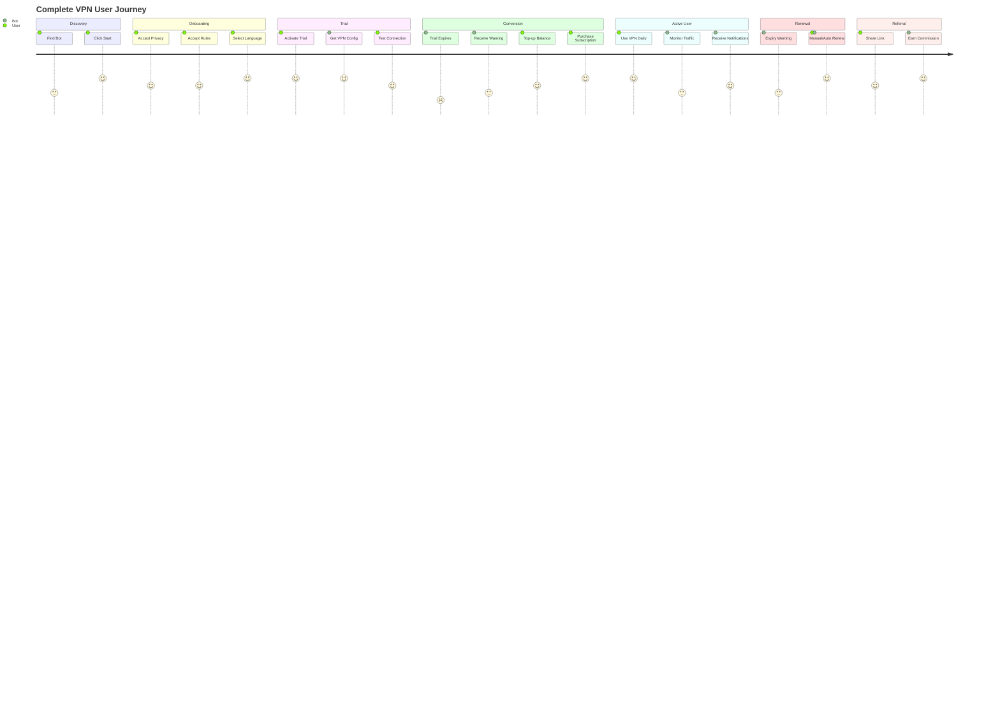

## Complete Lifecycle Flow

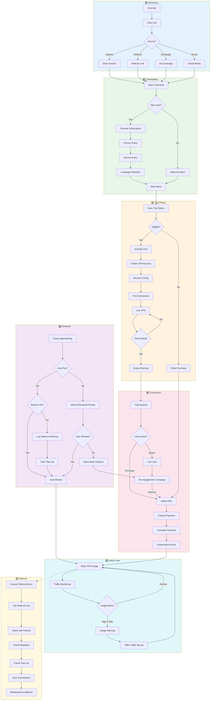

## User State Machine

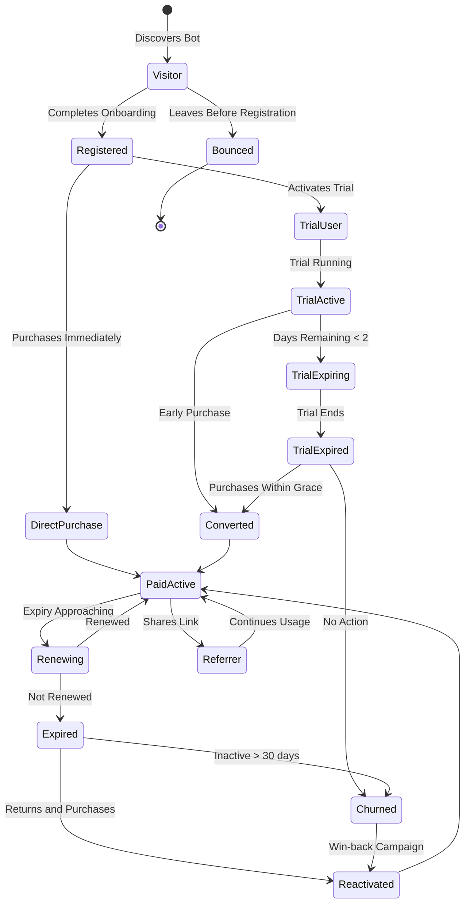

## Journey Phases

### 1️⃣ Discovery Phase

**How users find the bot:**

| Source | Description | Tracking | Conversion |
|--------|-------------|----------|------------|
| 🔍 Organic Search | Direct bot search in Telegram | None | ~15% |
| 👥 Referral Link | Friend's referral link | Referral code | ~35% |
| 📢 Ad Campaign | Marketing deep link | Campaign ID | ~20% |
| 📱 Social Media | Links in posts | UTM parameters | ~25% |

**Entry Points:**
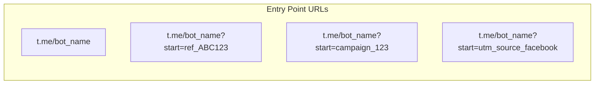

### 2️⃣ Onboarding Phase

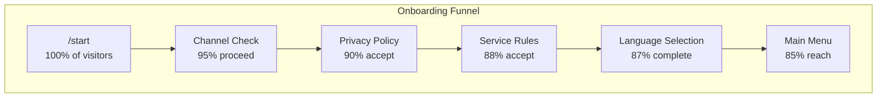

**Key Metrics:**
- Drop-off rate at each step
- Time to complete onboarding
- Language distribution
- Channel subscription rate

### 3️⃣ Trial Phase

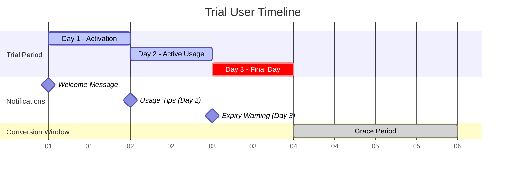

**Trial Success Indicators:**
| Indicator | Good | Warning | At Risk |
|-----------|------|---------|---------|
| First Connection | < 1 hour | < 24 hours | Never |
| Traffic Used | > 50% | 20-50% | < 20% |
| Sessions | Daily | 2-3 total | 1 or less |
| App Downloads | Yes | - | No |

### 4️⃣ Conversion Phase

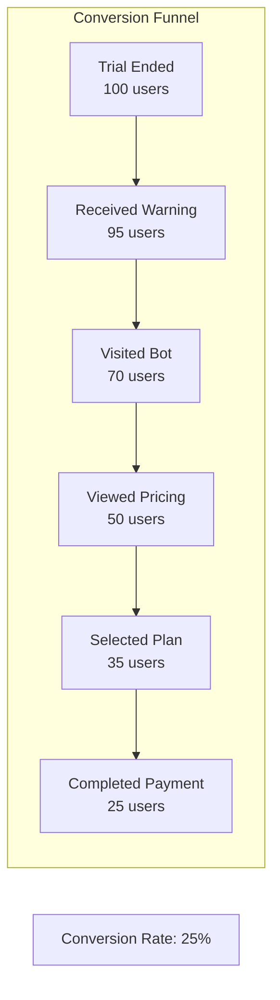

**Conversion Tactics:**
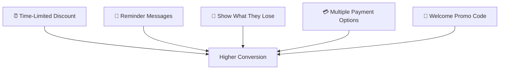

### 5️⃣ Active User Phase

**Daily Usage Pattern:**
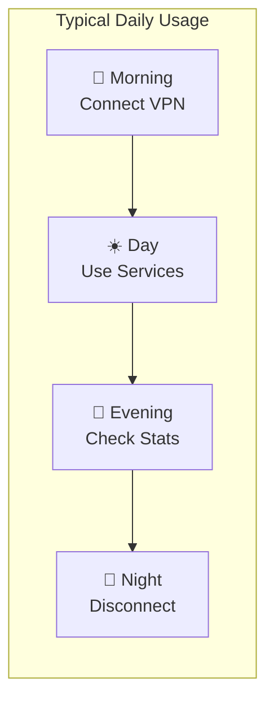

**Engagement Touchpoints:**
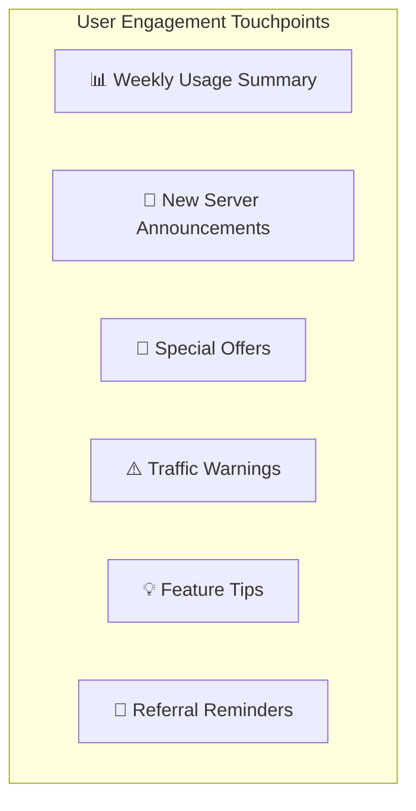

### 6️⃣ Renewal Phase

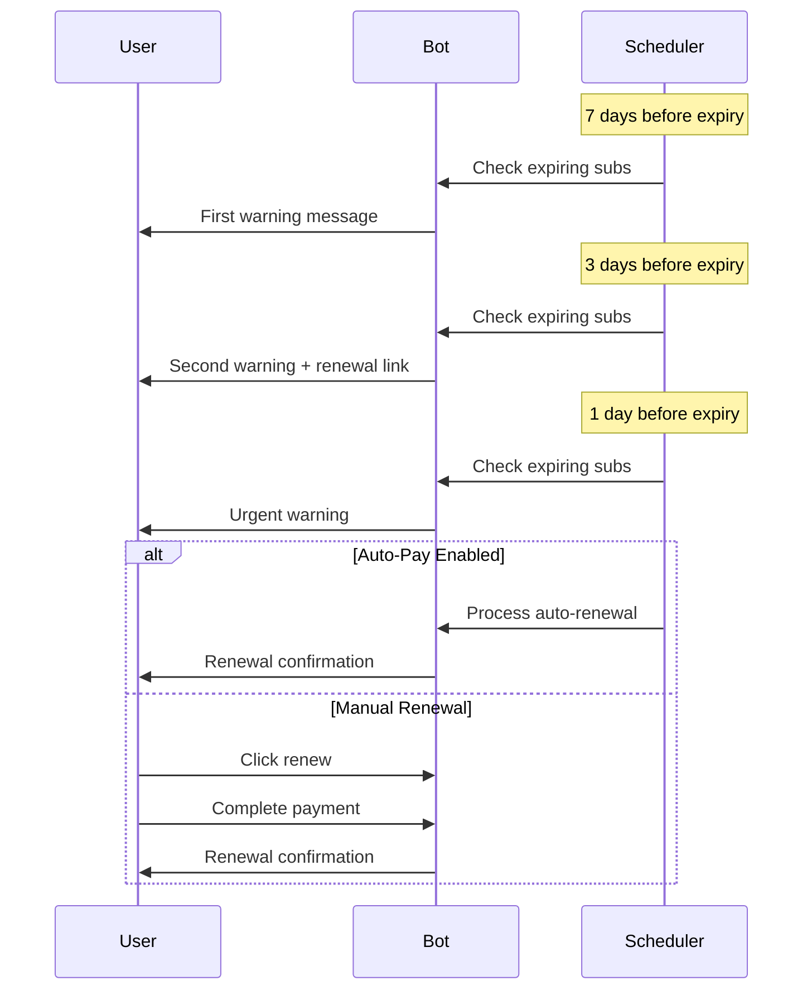

### 7️⃣ Referral Phase

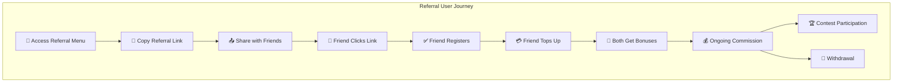
- Regular value reminders
- Usage statistics
- Loyalty discounts
- Early renewal incentives

### 6️⃣ Renewal Phase

**Renewal Timeline:**

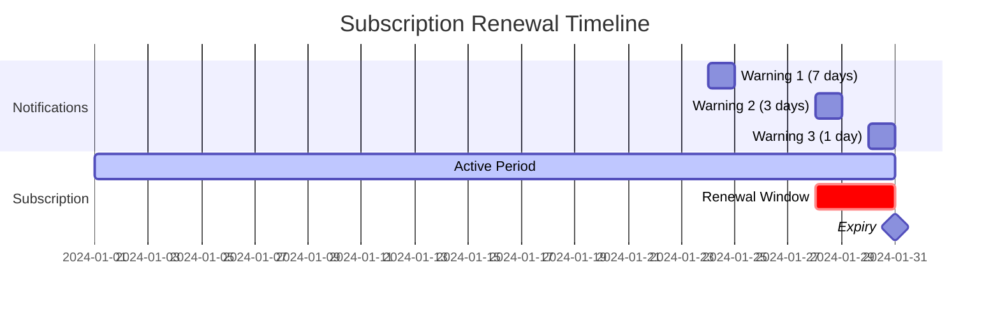

**Renewal Options:**

| Option | Trigger | User Effort |
|--------|---------|-------------|
| Auto-Pay | Enabled + Balance | Zero |
| Manual | Reminder → Action | Low |
| Lapsed | Post-expiry prompt | Medium |

### 7️⃣ Referral Phase

**Referral Funnel:**

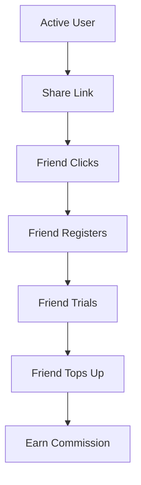

**Referral Incentives:**

| Event | Referrer Gets | Referee Gets |
|-------|---------------|--------------|
| Registration | - | - |
| First Top-up | `REFERRAL_INVITER_BONUS` | `REFERRAL_FIRST_TOPUP_BONUS` |
| Each Payment | `REFERRAL_COMMISSION_PERCENT`% | - |

## User Lifecycle States

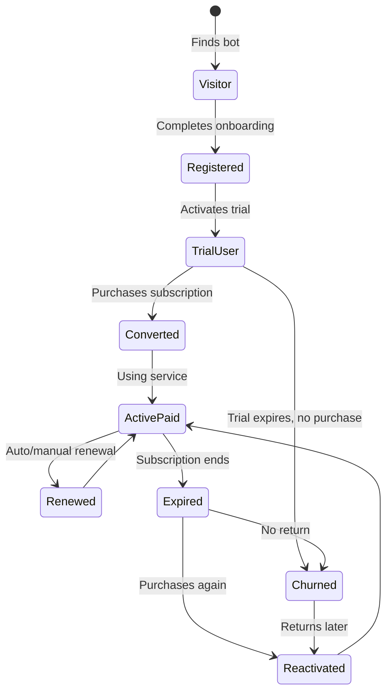

## Touchpoints & Notifications

| Phase | Touchpoint | Message Type |
|-------|------------|--------------|
| Onboarding | Welcome | Greeting + instructions |
| Trial Start | Config delivery | Technical setup |
| Trial End | Warning | Urgency + value |
| Purchase | Confirmation | Receipt + next steps |
| Active | Usage updates | Engagement |
| Pre-expiry | Reminder | Renewal call |
| Post-expiry | Win-back | Discount offer |

## Metrics by Phase

| Phase | Key Metric | Target |
|-------|-----------|--------|
| Discovery | Reach | Growth |
| Onboarding | Completion rate | >90% |
| Trial | Activation rate | >70% |
| Conversion | Trial→Paid | >20% |
| Active | DAU/MAU | >30% |
| Renewal | Renewal rate | >80% |
| Referral | Referral rate | >10% |

## Optimization Opportunities

### Reduce Friction
- One-tap trial activation
- Seamless payment flow
- Auto-configuration for popular apps

### Increase Value
- Premium server access
- Higher speeds
- More device slots

### Build Loyalty
- Tenure-based discounts
- Referral rewards
- Exclusive features

---

**Related Diagrams:**
- [User Registration](./02-user-registration.md)
- [Trial Activation](./05-trial-activation.md)
- [Subscription Purchase](./03-subscription-purchase-classic.md)
- [Referral System](./08-referral-system.md)

